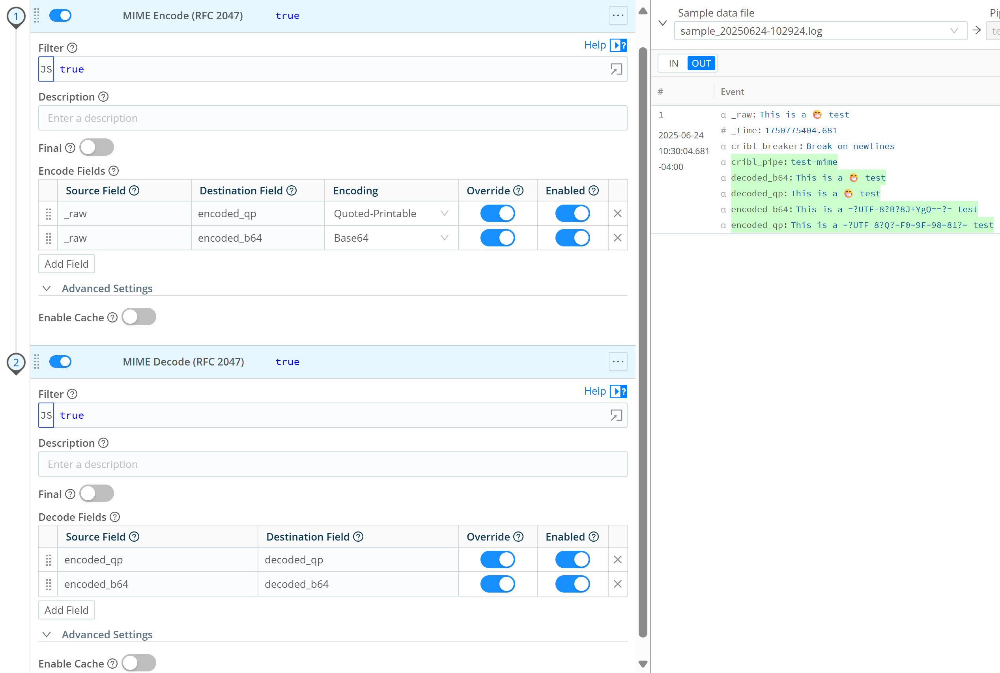

# dx-cribl-mime-rfc2047
Cribl functions to encode/decode [RFC 2047](https://datatracker.ietf.org/doc/html/rfc2047)



## Description
Cribl does not support native encoding/decoding of [RFC 2047](https://datatracker.ietf.org/doc/html/rfc2047).  A feature request has been filed under REQUEST-237 (2025-02-11).

## Installation
### Single Instance
1. Copy the custom function(s) to `/opt/cribl/local/cribl/functions`. 

```
mkdir -p /opt/cribl/local/cribl/functions
tar -xvzf dx-mime-encode_<version>.tar.gz -C /opt/cribl/local/cribl/functions
tar -xvzf dx-mime-decode_<version>.tar.gz -C /opt/cribl/local/cribl/functions
```

2. Reload (or restart) Cribl

### Distributed Deployment
Custom functions must be placed within packs and are only available within those packs. Furthermore, it's not posible to copy a pack from one worker group to another when the pack has a custom function; you must export the pack to a file then import it into the other worker group. Feature requests have been filed under REQUEST-204 and REQUEST-205 (2025-01-15).

1. Copy the custom function(s) to the pack

```
mkdir -p <pack-directory>/functions
tar -xvzf dx-mime-encode_<version>.tar.gz -C <pack-directory>/functions
tar -xvzf dx-mime-decode_<version>.tar.gz -C <pack-directory>/functions
```

2. Reload (or restart) the Cribl Leader